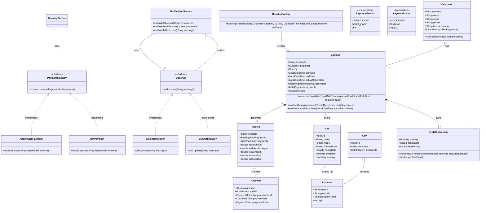

```mermaid

classDiagram
%% Payment classes demonstrating Strategy pattern
    class PaymentStrategy {
        <<interface>>
        +boolean processPayment(double amount)
    }
    PaymentStrategy <|.. CreditCardPayment : implements
    PaymentStrategy <|.. UPIPayment : implements

    class CreditCardPayment {
        +boolean processPayment(double amount)
    }

    class UPIPayment {
        +boolean processPayment(double amount)
    }

%% Observer Pattern for Notifications
    class Observer {
        <<interface>>
        +void update(String message)
    }
    Observer <|.. EmailNotification : implements
    Observer <|.. SMSNotification : implements
    NotificationService "1" -- "0..*" Observer : uses

class EmailNotification {
+void update(String message)
}

class SMSNotification {
+void update(String message)
}

class NotificationService {
+void addObserver(Observer observer)
+void removeObserver(Observer observer)
+void notifyObservers(String message)
}

%% Factory Pattern for Booking
class BookingFactory {
+Booking createBooking(Customer customer, Car car, LocalDateTime startDate, LocalDateTime endDate)
}

%% Core Classes with Relationships
class Booking {
+String bookingId
+Customer customer
+Car car
+LocalDateTime startDate
+LocalDateTime endDate
+LocalDateTime actualReturnDate
+RentalAgreement rentalAgreement
+List~Payment~ payments
+Invoice invoice
+boolean overlapsWith(LocalDateTime requestedStart, LocalDateTime requestedEnd)
+void setRentalAgreement(RentalAgreement rentalAgreement)
+void setActualReturnDate(LocalDateTime actualReturnDate)
}
BookingFactory --> Booking : creates

class Car {
+int carId
+String make
+String model
+String licensePlate
+double hourlyRate
+boolean available
+Location location
}

class City {
+int cityId
+String cityName
+List~Integer~ locationIds
}

class Customer {
+int customerId
+String name
+String email
+String phone
+String licenseNumber
+List~Booking~ bookingHistory
+void addBooking(Booking booking)
}

class Invoice {
+String invoiceId
+Booking bookingDetails
+List~Payment~ payments
+double baseAmount
+double additionalCharges
+double totalAmount
+double amountPaid
+double balanceDue
}

class Location {
+int locationId
+String pincode
+String locationName
+int cityId
}

class Payment {
+String paymentId
+double amountPaid
+PaymentMethod paymentMethod
+LocalDateTime paymentDate
+PaymentStatus paymentStatus
    }

class RentalAgreement {
+Booking booking
+double rentalCost
+double latePenalty
+void finalizeRentalAgreement(LocalDateTime actualReturnDate)
+double getTotalCost()
}

%% Enumeration Classes
class PaymentMethod {
<<enumeration>>
CREDIT_CARD
DEBIT_CARD
UPI
    }

class PaymentStatus {
<<enumeration>>
SUCCESSFUL
PENDING
FAILED
    }

%% Relationships and Cardinalities with Aggregation and Composition

%% Association (1 Customer has multiple Bookings)
Customer "1" -- "0..*" Booking : has

%% Composition (Booking owns RentalAgreement; lifetime tied)
Booking "1" *-- "1" RentalAgreement : owns

%% Composition (Booking generates Invoice; lifetime tied)
Booking "1" *-- "1" Invoice : generates

%% Aggregation (Invoice includes multiple Payments but Payments exist independently)
Invoice "1" -- "*" Payment : includes

%% Association (Booking uses a single Car per booking)
Booking "1" -- "1" Car : books

%% Association (Car is located in a specific Location)
Car "1" -- "1" Location : located_at

%% Aggregation (City has multiple Locations; Locations can exist independently of the City)
City "1" -- "*" Location : contains

%% Demonstrate Strategy Pattern in BookingService for Payments
BookingService "1" -- "1" PaymentStrategy : uses

%% Observer Pattern Relationships
NotificationService "1" -- "*" Observer : notifies


```